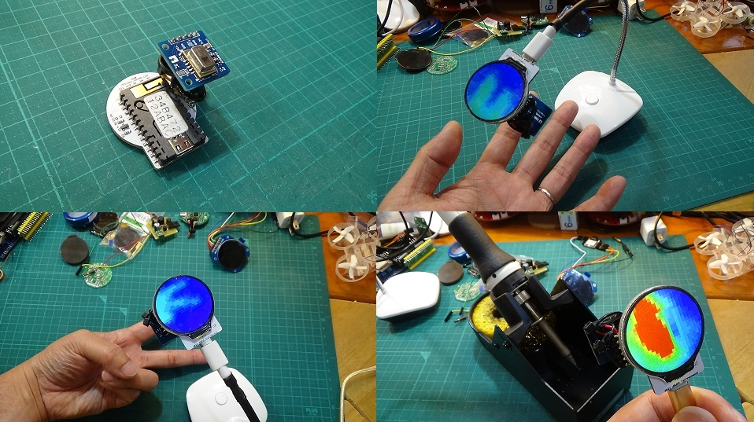

# M5Stampラウンド液晶モジュール

M5Stampを使用して1.28インチ240ｘ240ドットの円形液晶を駆動する基板モジュールです。

円形液晶の裏にM5Stampを配置することで、とても小さくスリムな形状になりました。

円形液晶にはGC9A01というコントローラーが使用されていますが、対応したグラフィックライブラリが数種類公開されています。

本モジュールは「グラフィックライブラリの使い方を理解して液晶モジュールを駆動出来る人」をターゲットにしております。

# 注意！！（必ずお読み下さい）

本品は基本的な電子回路の仕組みを理解した方を対象とした、電子部品がむき出しの半完成キットです。
電子部品は電源電圧や極性を間違えたり、部品を破損させたり部品端子をショートさせた場合、発熱・発煙・発火に至る場合もあります。
間違った使い方をすると危険である事を理解された方のみご使用ください。
趣味の電子工作向けに製作しておりますので、製品への組込みや日常生活へ組込んでのご使用はお止め下さい。

# 形状および回路図

以下に外形イメージを示します

以下に回路図を示します
　なお、基板Ver1.0の回路図などはこちら⇒
https://github.com/urukakanko/M5Stamp_round_lcd/tree/main/Ver1.0

# ピンアサイン

M5Stamp とLCDの制御信号とのピン接続は以下となります。

- SCLK:G4

- MOSI:G6

- DC:G1

- CS:G7

- RST:G0

- バックライト:G10

  

また、I2C接続などを想定した外部接続端子があります

注意：リード線をハンダ付けするパットとして使用します　コネクタやピンヘッダは挿せません。　基板Ver1.0ではスルーホールになっていますが無理やり挿すとピン先がLCDにぶつかって破損したりショートする恐れがあります。
また、6PINおよび7PINはセンサーなど小型周辺モジュールを駆動するための電源出力端子です。本モジュールを駆動するための電源入力としては設計しておりません。

- 1PIN : GND

- 2PIN : G20

- 3PIN : G21

- 4PIN : G8 (I2C SDAを想定)

- 5PIN : G9 (I2C SCLを想定)

- 6PIN : 5V

- 7PIN : 3.3V(基板Ver1.0にはありません　基板Ver1.1より対応) 

  

「M5Stamp C3U」　および　「 M5Stamp C3」　両方が使用出来る様にG3端子は未接続にしています

# 使用するツールやライブラリ

M5StampのArduino IDEへのインストールは、以下サイトを参考下さい。

https://docs.m5stack.com/en/quick_start/m5core/arduino

グラフィックライブラリについてはlovyan様のLovyanGFXにて動作確認をしています。

https://github.com/lovyan03/LovyanGFX

他、GC9A01に対応したライブラリが使用可能と考えています。

# LCD表示動画

https://youtu.be/kj006jx1wdU

# 使用例

スマートウォッチはもちろん、アイコン表示でカードフォルダー代わり

ロボットに顔写真を表示すると、とても味のある雰囲気に・・・

AMG8833と組合わせると温度虫眼鏡も作れます　動画はこちら
https://youtu.be/yjvwYW8tv_Q

AMG8833サーマルカメラの作り方をまとめました　とても便利ですので興味がある方はご覧ください

https://github.com/urukakanko/M5Stamp_round_lcd/tree/main/thermal_cam_demo

カラフルな液晶バッジ

# スイッチサイエンスマーケットプレイスで販売しています
M5Stamp実装版
https://www.switch-science.com/catalog/8098/

M5Stamp未実装版
https://www.switch-science.com/catalog/8099/

# 製作者

ウルカテクノロジー
Hiroyuki Sunagawa

https://www.facebook.com/URUKA-Technologies-105478404379918
