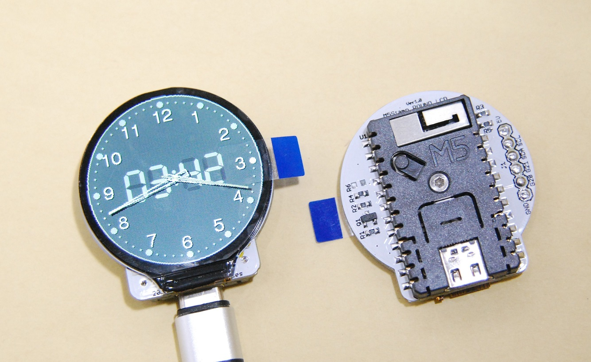
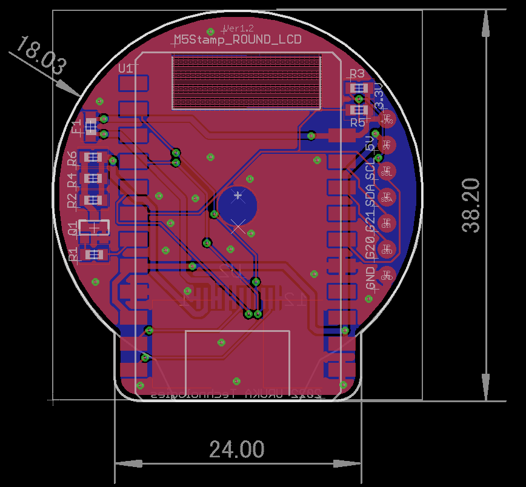

# M5Stampラウンド液晶モジュール

M5Stampを使用して1.28インチ240ｘ240ドットの円形液晶を駆動する基板モジュールです。

液晶基板に直接M5Stampを実装するので、配線が不要になってとてもシンプルに使うことが出来ます。

円形液晶にはGC9A01というコントローラーが使用されておりますが、Arduino IDEには対応したライブラリが数種類公開されていますので、ライブラリを導入してサンプルプログラムを動かすことで簡単に扱えます。

# 形状および回路図

以下に外形イメージを示します

以下に回路図を示します

# ピンアサイン

M5Stamp とLCD信号とのピンアサインは以下となります。

（M5Stamp C3U　および　 M5Stamp C3　両方が使用出来る様にG3は未接続にしています）

- SCLK:G4
- MOSI:G6
- DC:G1
- CS:G7
- RST:G0
- バックライト:G10

また、I2C接続などを想定した外部接続端子があります

-  1PIN : GND
-   2PIN : G20
-   3PIN : G21
-   4PIN : G8 (I2C SDAを想定)
-   5PIN : G9 (I2C SCLを想定)
-   6PIN : 5V

# 使用するライブラリ

当方ではlovyan様のLovyanGFXにて動作確認をしています。

他、GC9A01に対応したライブラリが使用可能と考えています。

# 使用例

スマートウォッチはもちろん、アイコン表示バッチ、カードフォルダーの代わりなど

ロボットに顔写真を表示すると、とても味のある雰囲気になります

# 製作者

Hiroyuki Sunagawa

https://www.facebook.com/hiroyuki.sunagawa.5
