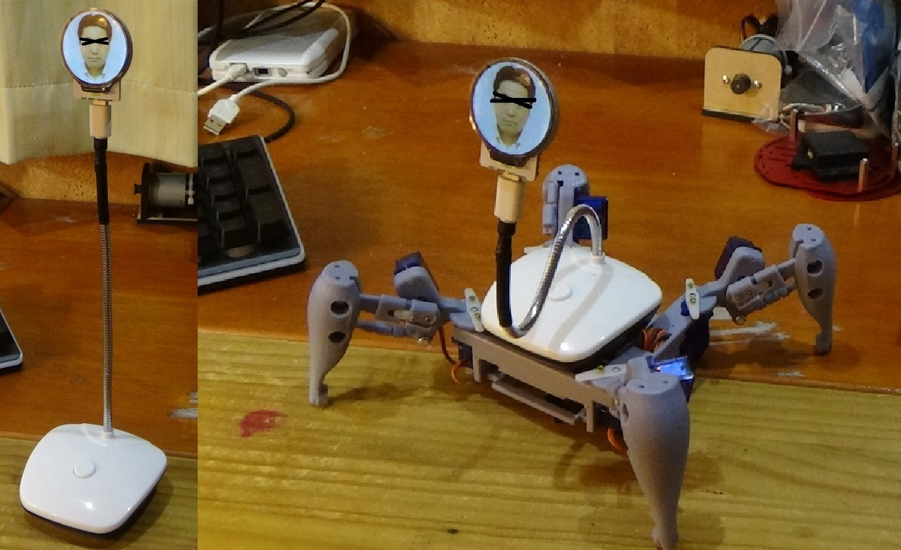

# M5Stampラウンド液晶モジュール

M5Stampを使用して1.28インチ240ｘ240ドットの円形液晶を駆動する基板モジュールです。

液晶の裏にM5Stampを配置することで、とても小さくスリムになっています。

円形液晶にはGC9A01というコントローラーが使用されていますが、対応したArduinoライブラリが数種類公開されています。

本モジュールは「ライブラリの使い方を理解してLCDを駆動出来る人」をターゲットにしております。

# 形状および回路図

以下に外形イメージを示します

以下に回路図を示します

# ピンアサイン

M5Stamp とLCDの制御信号とのピン接続は以下となります。

- SCLK:G4

- MOSI:G6

- DC:G1

- CS:G7

- RST:G0

- バックライト:G10

  

また、I2C接続などを想定した外部接続端子があります

（注意：リード線用です　コネクタやピンヘッダは付けられません　無理に挿すとLCDにぶつかって破損してしまいます）

- 1PIN : GND

- 2PIN : G20

- 3PIN : G21

- 4PIN : G8 (I2C SDAを想定)

- 5PIN : G9 (I2C SCLを想定)

- 6PIN : 5V

  

「M5Stamp C3U」　および　「 M5Stamp C3」　両方が使用出来る様にG3端子は未接続にしています

# 使用するライブラリ

M5StampのArduino IDEへのインストールは、以下サイトを参考下さい

https://docs.m5stack.com/en/quick_start/m5core/arduino

グラフィックライブラリについてはlovyan様のLovyanGFXにて動作確認をしています

https://github.com/lovyan03/LovyanGFX

他、GC9A01に対応したライブラリが使用可能と考えています。

# LCD表示動画

https://youtu.be/kj006jx1wdU

# 使用例

スマートウォッチはもちろん、アイコン表示でカードフォルダー代わり

ロボットに顔写真を表示すると、とても味のある雰囲気に・・・

画像が動くバッジ

# 製作者

Hiroyuki Sunagawa

https://www.facebook.com/hiroyuki.sunagawa.5
