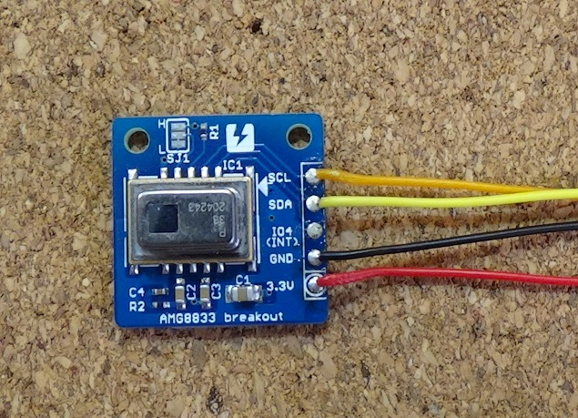
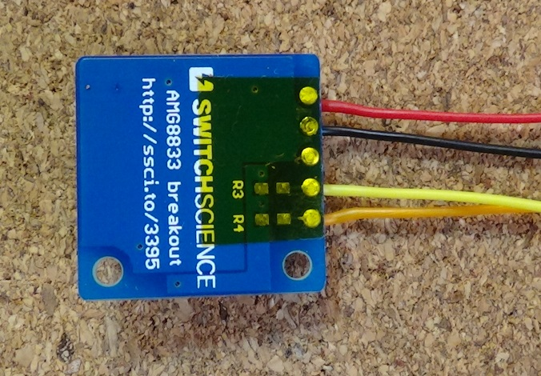
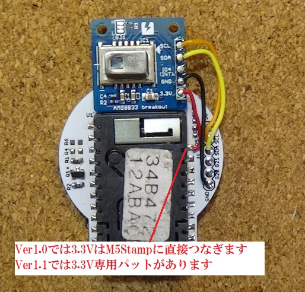
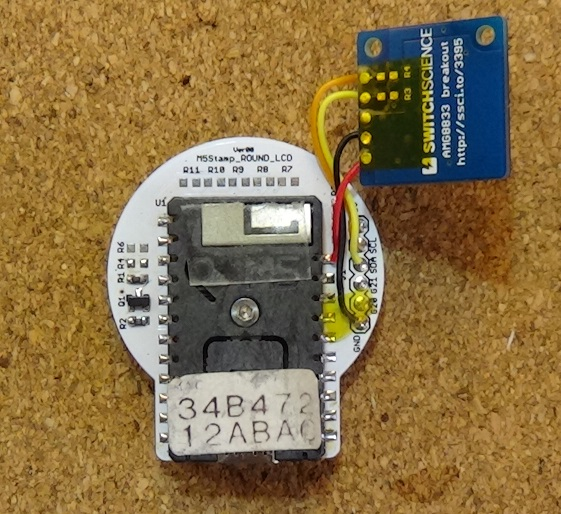
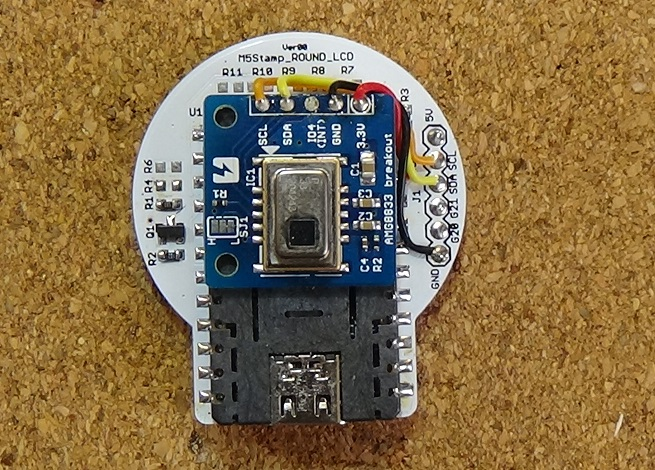
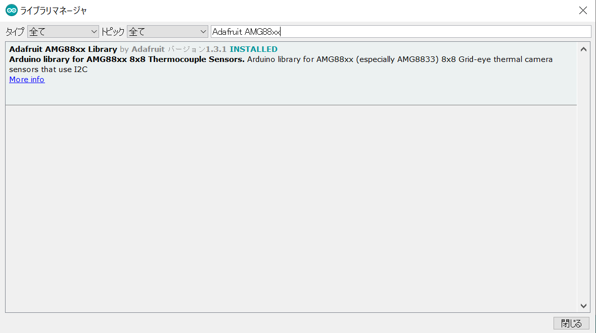
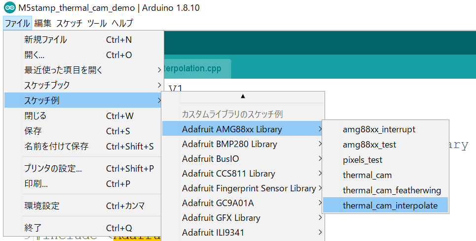
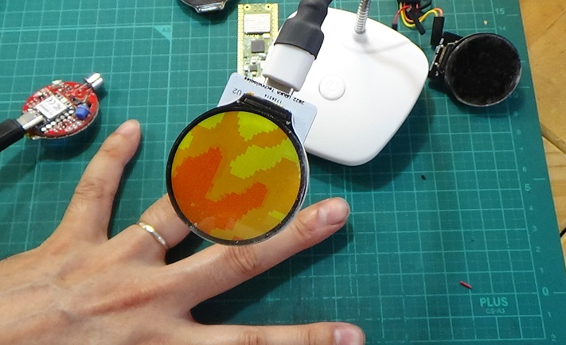

# M5Stampラウンド液晶モジュール作例　AMG8833サーマルカメラ

電子工作をしていると異常発熱する部品があったりしてサーモグラフィーで観察したくなる場合があります。

でもそんな高級品はなかなか買えません。そんなときAMG8833を使用した簡易サーマルカメラが役に立ちます。

AMG8833はパナソニック製の８ｘ８セルのサーマルセンサーです。I2Cインターフェースで制御します。

なお、AMG8833自体を詳しく弄りたい方はこちらを購入するとよいと思います。

https://www.switch-science.com/catalog/3498/

## ハードの作り方

AMG8833モジュールを入手します。スイッチサイエンスや秋月電子で入手が可能です。

今回はスイッチサイエンスで販売しているモジュールが手元にあったのでそれで作ってみます

以下の様にAMG8833モジュールにリード線をハンダ付けします

必要な接続線は、３．３V、GND、SDA、SCL　の４本です。リード線を使ってAMG8833モジュールとM5Stampラウンド液晶モジュールをつなげます。

裏面を念のためにテープ等で絶縁しています。ポリイミドテープ（カプトンテープ）がお勧めです

リード線の反対側をM5Stampラウンド液晶モジュールに結線します。

M5Stampラウンド液晶モジュールVer1.0の場合は3.3Vパットを出していないので、M5Stampの端子に直接リード線をハンダ付けします。

M5Stampに両面テープを貼り、そこにAMG8833モジュールを貼り付けます

## プログラミング

Arduino IDEでプログラミングします。

今回AMG8833を駆動させるために、Adafruit AMG88xx Library　を使用します。

スケッチ⇒ライブラリをインクルード⇒ライブラリを管理　でライブラリマネージャを開き　Adafruit AMG88xxで検索します

ライブラリをインストールしたら、スケッチの例を呼び出します。

AMG8833をTFT液晶に表示するスケッチ例「thermal_cam_interpolate.ino」が準備されてましたので使用しました。

ただし使用する液晶が異なる事、表示位置のオフセット、補完内容の変更などがあるので修正が必要となります。

修正後のソースコードは以下に保存しています。

https://github.com/urukakanko/M5Stamp_round_lcd/tree/main/thermal_cam_demo/M5stamp_thermal_cam_demo/M5stamp_thermal_cam_demo

### ソースコード修正のポイント説明

#### 液晶設定と液晶ライブラリについて

スケッチ例では使用する液晶がILI9341になっているのでGC9A01に直す必要があります。

また使用する液晶ライブラリはAdafruit_GFXになっています。　このライブラリでGC9A01も駆動可能なのですが動作速度がちょっと遅かったです。解像度を上げると厳しいので高速化のためにLavyanGFXを使用しています。

ソースコードの先頭から94行目まで入れ替えてあります。

#### 補完について

AMG8833は　8x8(64)セル　のサーマルセンサーなので、このまま映像化しても粗いモザイクの画像になります。そこで補完計算を行い解像の高い画像にしています。

ただし解像度を高くするほど計算に時間がかかってしまいますので表示速度の頃合いをみて40x40にしています。

ソースコード136行目と137行目で設定しています

　#define INTERPOLATED_COLS 40
　#define INTERPOLATED_ROWS 40

#### その他

AMG8833のI2Cアドレスは159行目で0x68に指定しています。必要に応じて0x69にしてください。

液晶の解像度自体が元とは異なるので表示位置を調整しています。

円型液晶は表示領域が狭いので、凡例表示は無しにしました。

## 動作イメージ

100円ショップのLEDライトスタンドを改造したラウンド液晶スタンドに取り付けてみました。

手の形がなんとか見えるという感じです。

ラズベリーパイ４＋OpenCVで取得できる画像と比較するときついけど、常に持ち歩いて必要な時に即座に使うとか出来るので利便性はとても良いです。
